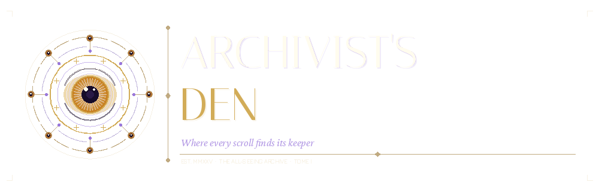

<p align="center">
  
</p>

# DnD Hub

A full-stack toolkit for Dungeon Masters and homebrew creators. Manage campaigns, build encounters, and bring your world to life with AI-powered assistants for characters, creatures, spells, maps, and more.

---

## Progress

| Layer | Status | Notes |
|---|---|---|
| 🗄️ Database schema | ✅ Complete | Migrations for users, compendium, sessions and homebrew |
| 🌱 SRD seeds | 🔜 Pending | Import SRD 2014/2024 content from dnd5eapi.co |
| ⚙️ Backend | 🟡 Started | Flask REST API with health check endpoint, deployed on Render |
| 🎨 Frontend | 🟡 Started | React + Vite SPA with health check, deployed on Vercel |

---

## Tech stack

| Layer | Technology | Hosting |
|---|---|---|
| Frontend | React + Vite | Vercel |
| Backend | Flask (Python) | Render |
| Database | Supabase (PostgreSQL) | Supabase cloud |
| AI | Anthropic API | — |

---

## Repository structure

- `backend/` — REST API built with Flask
- `frontend/` — Single-page app built with React
- `database/migrations/` — SQL migrations for Supabase (run in order)
- `database/seeds/` — Seed data for sources and SRD content

---

## Features

**Session management**
- [ ] Session creation and management
- [ ] Character upload and sharing
- [ ] Collaborative session content

**Tools**
- [ ] Dice roller
- [ ] Encounter calculator

**AI-assisted creators**
- [ ] Character creator
- [ ] Creature creator
- [ ] Spell creator
- [ ] Race creator
- [ ] Class creator
- [ ] Item creator
- [ ] Puzzle generator
- [ ] Map creator
- [ ] Plot writer

**AI assistants**
- [ ] Character & creature interpreter
- [ ] Dungeon Master

---

## Deployment

### Database (Supabase)

1. Create a new project at [supabase.com](https://supabase.com)
2. Go to **SQL Editor** and run each migration file in order:
   ```
   database/migrations/001_users_and_sources.sql
   database/migrations/002_compendium.sql
   database/migrations/003_sessions_and_homebrew.sql
   ```
3. Run the seed files:
   ```
   database/seeds/001_sources.sql
   ```
4. Copy your project's **URL**, **anon key** and **service role key**
   from **Project Settings → API** — you'll need them for the backend.

### Backend (Render)

The backend is deployed at `https://dnd-hub-1sf8.onrender.com`.

1. Clone the repository and create a new **Web Service** on [render.com](https://render.com)
2. Configure the service:
   - **Root Directory:** `backend`
   - **Build Command:** `pip install uv && uv sync --frozen`
   - **Start Command:** `uv run gunicorn "app:create_app()"`
3. Add the following environment variables:
   ```
   FLASK_SECRET_KEY=your-secret-key-here
   FLASK_ENV=production
   CORS_ORIGINS=https://dnd-hub-beta.vercel.app
   ```

### Frontend (Vercel)

The frontend is deployed at `https://dnd-hub-beta.vercel.app`.

1. Create a new project on [vercel.com](https://vercel.com) and connect your repository
2. Configure the project:
   - **Root Directory:** `frontend`
   - **Framework Preset:** `Vite`
   - **Build Command:** `npm run build`
   - **Output Directory:** `dist`
   - **Production Branch:** `develop`
3. Add the following environment variables:
   ```
   VITE_API_URL=https://dnd-hub-1sf8.onrender.com
   ```

---

## Local development

### Backend

1. Navigate to the `backend/` directory
2. Copy the environment file and fill in your values:
   ```bash
   cp .env.example .env
   ```
3. Install dependencies:
   ```bash
   uv sync
   ```
4. Run the development server:
   ```bash
   uv run python run.py
   ```
5. Verify the health check:
   ```bash
   curl http://localhost:5000/api/health
   ```

### Frontend

1. Navigate to the `frontend/` directory
2. Install dependencies:
   ```bash
   npm install
   ```
3. Run the development server:
   ```bash
   npm run dev
   ```
4. Open `http://localhost:5173` in your browser

> The frontend dev server proxies `/api` requests to `http://localhost:5000`,
> so the backend must be running locally for API calls to work.